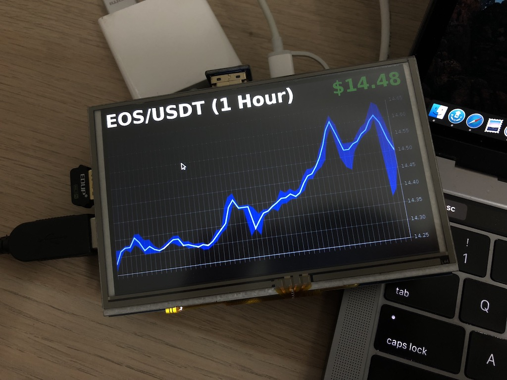

# Raspberry Pi Cryptocurrency Tracker

# Description
A cryptocurrency tracker to save my idled Raspberry Pi.

This tiny project is for personal purpose and experiments, it's now tracking just `EOS` for example.

Using [Huobi REST API](https://github.com/huobiapi/API_Docs/wiki/REST_api_reference) and [Chart.js](http://www.chartjs.org)

To support `<canvas>` i suggust use [Midori Browser](http://Midori-browser.org/) instead of `Epiphany` (aka default browser).
